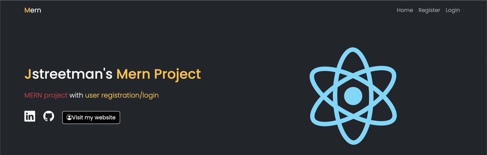
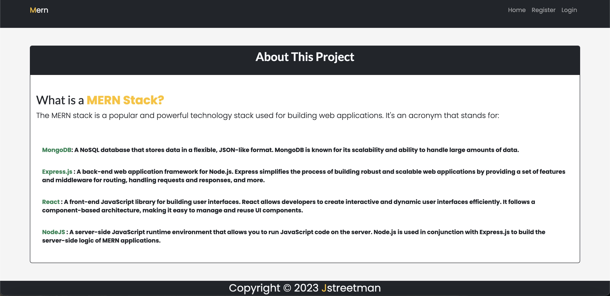
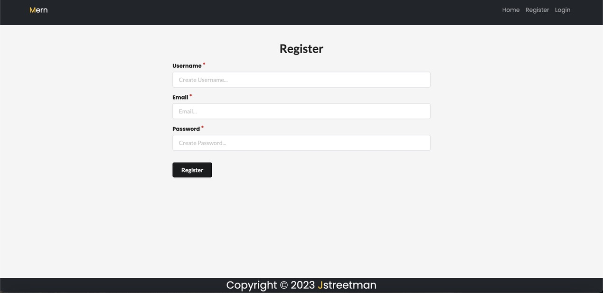
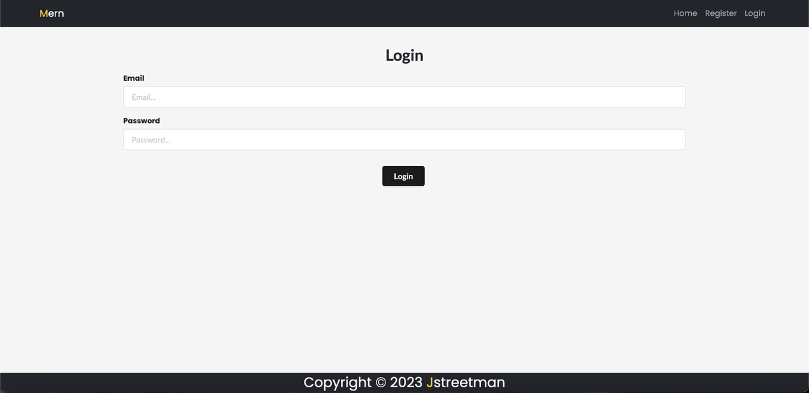
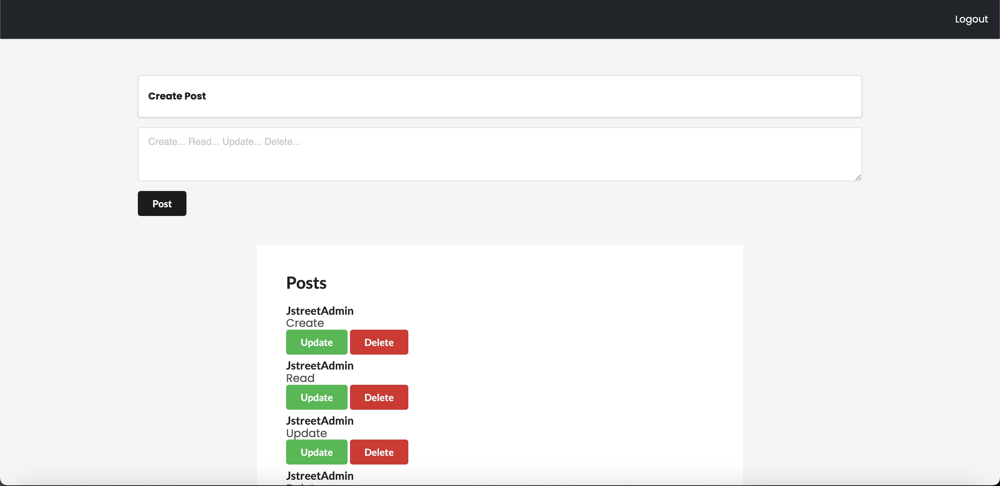

# MERN Version 1.0.9

# This is a MERN stack example

# About This Project

# How To Run

If you want to Modify the Frontend:
cd /client
npm install
npm start
npm build to view changes to frontend
view in browser : localhost:4200

To run app in build after changes to frontend or backend:
make sure you have node modules installed in the root of project folder
npm install
nodemon server or npm start(root of your project, not in /client)
view in browser : localhost:3000

# What's New In 1.0.9

Final Code to Complete Stack
